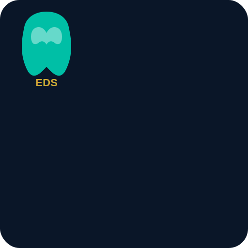

<p align="center">
  
</p>

<h1 align="center">Everyday Dental Surgery & Implant Center</h1>

<p align="center">
  <strong>HIPAA-compliant dental clinic platform with FHIR R4 interoperability</strong>
</p>

<p align="center">
  
  
  
  
  
</p>

<p align="center">
  
  
  
  
</p>

---

## Overview

A fully responsive, bilingual (English/Bengali) dental clinic platform for **Everyday Dental Surgery & Implant Center** in Dhaka, Bangladesh. Built with React 18 + Supabase, featuring HIPAA-compliant PHI encryption, FHIR R4 health data interoperability, and SOC 2 documentation.

## Compliance

| Standard | Coverage |
|----------|----------|
| **HIPAA Security Rule** | Auth, RBAC, encryption, audit logging, auto-logout, breach detection |
| **HIPAA Privacy Rule** | Consent tracking, patient data rights (access/amend/delete/restrict) |
| **FHIR R4 4.0.1** | Patient, Appointment, Practitioner, Organization, AllergyIntolerance, Condition |
| **SOC 2 TSC** | CC1-CC9, A1, PI1, P1, C1 — 11 policy documents |

## Features

- **Patient Portal** — view appointments, medical data, FHIR export, data rights requests
- **Admin Dashboard** — appointments, registrations, contacts, audit logs, user management, breach detection
- **PHI Encryption** — AES-256 column-level encryption via pgcrypto + Supabase Vault
- **FHIR R4 API** — REST endpoints with SNOMED CT and ICD-10 terminology bindings
- **Immutable Audit Trail** — every data access logged (including SELECT via Edge Functions)
- **Role-Based Access** — patient / doctor / receptionist / admin with RLS policies
- **Auto-Logout** — 15-minute inactivity timeout (HIPAA 164.312(a)(2)(iii))
- **Breach Detection** — automated anomaly rules with 60-day notification tracking
- **Data Retention** — configurable per-table retention with automated pg_cron purge
- **No PHI in Email** — server-side notifications via Resend (reference numbers only)
- **Bilingual** — seamless English/Bengali toggle
- **Cinematic UI** — GSAP + Framer Motion + Tailwind animations, Lenis smooth scroll
- **PWA Ready** — installable with service worker

## Tech Stack

| Category | Technologies |
|----------|-------------|
| **Frontend** | React 18, React Router v6, Vite 5 |
| **Backend** | Supabase (PostgreSQL, Auth, Edge Functions) |
| **Styling** | Tailwind CSS 3.4 |
| **Animations** | GSAP 3, Framer Motion 11, Lottie |
| **Encryption** | pgcrypto (AES-256), Supabase Vault |
| **FHIR** | HL7 FHIR R4 4.0.1, SNOMED CT, ICD-10-CM |
| **Email** | Resend (HIPAA-safe, no PHI) |
| **Hosting** | Cloudflare Pages (static) + Supabase (backend) |

## Quick Start

### Prerequisites

- Node.js 18+
- Supabase account (Pro plan for HIPAA compliance)

### Installation

```bash
git clone https://github.com/Zahidulislam2222/dental-clinic.git
cd dental-clinic
npm install
npm run dev
```

The dev server runs at `http://localhost:3000`.

### Environment Setup

```bash
cp .env.example .env
# Fill in VITE_SUPABASE_URL and VITE_SUPABASE_ANON_KEY
```

### Production Build

```bash
npm run build
npm run preview
```

## Project Structure

```
dental-clinic/
├── docs/
│   ├── policies/             # SOC 2 policy documents (11 files)
│   └── baa/                  # BAA checklist and signed agreements
├── public/
│   ├── _headers              # Security headers (COEP, COOP, CSP, HSTS)
│   ├── icons/                # PWA icons
│   └── manifest.json         # PWA manifest
├── src/
│   ├── components/
│   │   ├── admin/            # DataTable
│   │   ├── auth/             # ProtectedRoute, SessionTimeout
│   │   ├── layout/           # Navbar, Footer, AnnouncementBar
│   │   ├── patient/          # AppointmentList, MedicalDataView, DataExport, DataRequest
│   │   └── ui/               # Button, TiltCard, MagneticButton, etc.
│   ├── context/              # AuthContext, LanguageContext
│   ├── lib/                  # supabase.js, fhir.js, fhir-terminology.js, fhir-validator.js
│   ├── pages/
│   │   ├── admin/            # AdminDashboard + 9 sub-pages
│   │   ├── LoginPage.jsx     # + Signup, ForgotPassword, ResetPassword, Unauthorized
│   │   └── PatientDashboard.jsx
│   └── utils/                # emailService.js, sanitize.js, rateLimit.js
├── supabase/
│   ├── functions/            # 9 Edge Functions + 2 shared utilities
│   │   ├── submit-form/      # Server-side form validation + encryption
│   │   ├── get-patient-data/ # Audited PHI access
│   │   ├── fhir-api/         # FHIR R4 REST API
│   │   ├── fhir-export/      # FHIR Bundle export
│   │   ├── send-notification/# HIPAA-safe email (no PHI)
│   │   ├── admin-query/      # Admin data access + audit
│   │   ├── admin-resolve-request/
│   │   ├── admin-manage-user/
│   │   ├── breach-check/     # Anomaly detection
│   │   └── _shared/          # sanitize.ts, rate-limit.ts
│   └── migrations/           # 001-009 SQL migrations
├── .env.example
├── CLAUDE.md
└── package.json
```

## Database Migrations

Run in order via Supabase SQL Editor:

| Migration | Purpose |
|-----------|---------|
| `001_initial_schema.sql` | Base tables (contacts, appointments, registrations, newsletter) |
| `002_auth_rbac.sql` | User profiles, roles, auto-profile trigger |
| `003_rbac_policies.sql` | RLS policies, role helper functions, reception views |
| `004_encryption.sql` | pgcrypto, PHI encryption functions, encrypted columns |
| `005_audit_logging.sql` | Immutable audit_logs, triggers on all tables |
| `006_consent_tracking.sql` | Consent records, data access requests |
| `007_fhir_schema.sql` | FHIR resources table, seed data |
| `008_data_retention.sql` | Retention policies, purge function, pg_cron |
| `009_breach_notification.sql` | Security incidents, anomaly rules |

## Deployment

### Frontend (Cloudflare Pages)

Already deployed at `dental-clinic-anq.pages.dev`. Auto-deploys from `master` branch.

| Setting | Value |
|---------|-------|
| **Build command** | `npm run build` |
| **Output directory** | `dist` |
| **Node.js version** | `18` |

### Backend (Supabase)

1. Upgrade to Pro plan and sign BAA
2. Enable extensions: `pgcrypto`, `pg_cron`, `vault`
3. Run migrations 001-009 in SQL Editor
4. Set secrets: `supabase secrets set PHI_ENCRYPTION_KEY=... RESEND_API_KEY=...`
5. Deploy functions: `supabase functions deploy`

## Design System

| Token | Color | Usage |
|-------|-------|-------|
| **Navy** | `#0A1628` | Primary dark background |
| **Teal** | `#00BFA6` | Primary accent |
| **Gold** | `#D4AF37` | Luxury accent |
| **Off-white** | `#F8FAFC` | Light background |

**Fonts:** Plus Jakarta Sans (headings) · Inter (body)

## License

This project is proprietary. All rights reserved.

---

<p align="center">
  Built with care for <strong>Everyday Dental Surgery & Implant Center</strong>, Dhaka, Bangladesh
</p>
