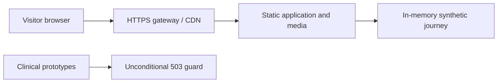

# Everyday Dental

A bilingual English/Bangla dental-clinic website and interactive synthetic patient journey built with React and Vite. This repository includes frontend source, preserved Supabase clinical prototypes, database migrations, automated checks and a staged production roadmap.

[Public demo](https://dental.zahidul-islam.com) · [Documentation](docs/README.md) · [Frontend](src/README.md) · [Backend](supabase/README.md) · [Roadmap](ROADMAP.md)

## Explore the project

Browse clinic services, prices and articles, then open **/experience** for sample appointment cancellation, consent withdrawal, role denial, held erasure and FHIR-shaped export. **/trust** explains privacy and security boundaries. People, testimonials and outcomes are fictional demonstration content.

| Area | Current release | Future milestone |
|---|---|---|
| Website | Responsive SPA, bilingual presentation and local media | Broader accessibility and performance qualification |
| Patient journey | Fixed synthetic records in browser memory | Authenticated, tenant-scoped clinical workflows |
| Backend | 11 guarded Edge Function prototypes | Repair and verify clinical release gates |
| Database | 11 historical migrations | Tested clean install, upgrade, RLS and recovery |
| Capacity | Workload calculator and bounded local test | 10k → 100k → 1M+ concurrent-user qualification |
| Reliability | Proposed 99% availability objective | Independent monitoring, measured recovery and redundancy |

Real intake, clinical login, payment, email and SMS are disabled. Browser role selection illustrates policy; it does not authenticate users. [Clinical activation](docs/CLINICAL-RELEASE.md) is a separate engineering milestone.

## Run locally

Use Node.js 24+ and the committed lockfile. No cloud account or clinical credentials are required.

```bash
npm ci
npm run dev
```

Vite prints the development URL; the configured default is http://localhost:3000. Optional public settings are in [.env.example](.env.example) and [configuration](docs/CONFIGURATION.md). VITE_ settings are public browser values, never secrets.

```bash
npm run check
npm audit
npm run preview
# Keep preview running; use another terminal:
npm run test:browser
node scripts/security-check.mjs
node scripts/capacity.mjs
node scripts/load-local.mjs
```

Install Chromium when needed with `npx playwright install chromium`. Browser tests default to http://127.0.0.1:4173; the load script accepts loopback only. See [testing](docs/TESTING.md) for scope and limits.

## Architecture


```mermaid
flowchart LR
    Browser[Visitor browser] --> Edge[HTTPS gateway / CDN]
    Edge --> Static[Static application and media]
    Static --> Demo[In-memory synthetic journey]
    Backend[Clinical prototypes] --> Guard[Unconditional 503 guard]
```

The frontend has no active clinical client. [Architecture](docs/ARCHITECTURE.md) describes the proposed authenticated API, tenant boundaries, database and queue design.

## Documentation

| Need | Guides |
|---|---|
| Develop | [Frontend](src/README.md), [backend](supabase/README.md), [configuration](docs/CONFIGURATION.md) |
| Understand contracts | [Architecture](docs/ARCHITECTURE.md), [API](docs/API.md), [migrations](supabase/migrations/README.md) |
| Plan growth | [Scalability](docs/SCALABILITY.md), [capacity qualification](docs/CAPACITY-PLAN.md), [roadmap](ROADMAP.md) |
| Operate | [Reliability](docs/RELIABILITY.md), [operations](docs/OPERATIONS.md), [continuity](docs/policies/BUSINESS_CONTINUITY_PLAN.md) |
| Assess risk | [Security](SECURITY.md), [threat model](docs/THREAT-MODEL.md), [US/EU legal research](docs/LEGAL-RESEARCH.md), [Bangladesh](docs/LEGAL-BANGLADESH.md), [governance](docs/GOVERNANCE.md) |
| Review evidence | [Verification](docs/VERIFICATION.md), [testing](docs/TESTING.md), [clinical gates](docs/CLINICAL-RELEASE.md) |
| Contribute or reuse | [Contributing](CONTRIBUTING.md), [support](SUPPORT.md), [licensing](docs/LICENSING.md), [media sources](docs/MEDIA-SOURCES.md) |

## Future scale and availability

The roadmap targets **1M+ simultaneous users** using defined workloads, separate public/clinical capacity models, regional delivery, bounded database connections, asynchronous work and staged failure tests. The **99% availability objective** uses a rolling 30-day window. Stronger future objectives depend on measured readiness. Plans define assumptions, proposed thresholds, costs and acceptance evidence.

## Publication and release

Frontend and backend source are versioned together. GitHub publication, application deployment, database migrations and clinical activation are separate steps. CI is manual-only; verify the Actions allowance before dispatching hosted jobs. Private credentials and recovery artifacts stay excluded.

See [release notes](CHANGELOG.md). No project-wide open-source license has been selected; [licensing](docs/LICENSING.md) explains reuse and third-party rights.
