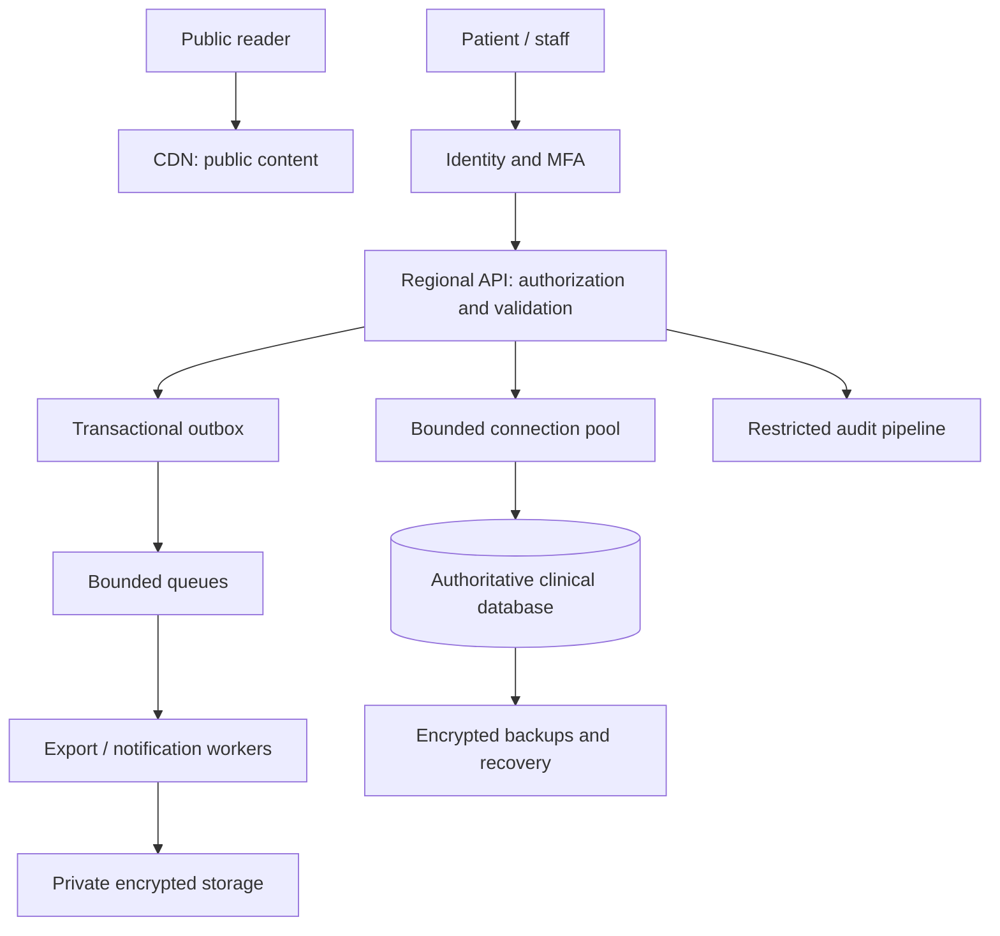

# Architecture

## Current release

An HTTPS gateway/CDN serves the static React application and local media. Lazy routes render clinic presentation. Synthetic actions call pure policy/state functions in browser memory. Intake is read-only, the clinical client is disabled, and all eleven preserved Edge Functions return a fixed guard. The demo has no clinical runtime dependency.

## Proposed clinical design

Separate cacheable public traffic from health-data workflows. Derive subject, tenant, care assignment and role from verified server identity. Browser identifiers never authorize access. Database constraints and RLS add enforcement; service credentials require narrowly scoped operations.

| Decision | Reason and tradeoff |
|---|---|
| Static delivery | Efficient public caching; does not establish clinical capacity |
| Stateless API | Replaceable workers; durable state moves to database/queues |
| Regional ownership | Residency and consistency boundaries; cross-region writes need conflict design |
| Database booking constraint | Prevents double bookings under concurrency; test transactions and retries |
| Transactional outbox | Couples committed state with eventual jobs; consumers need deduplication |
| Bounded concurrency | Prevents cascading overload; admission control may reject excess traffic |
| Least privilege plus RLS | Multiple barriers; privileged paths require extra tests |
| Central config/data | Provider/content changes avoid business-code edits; validate unsafe settings |

## Clinical data lifecycle

Minimize collection → verify identity and scope → commit controlled records → emit redacted audit events → process approved jobs → serve scoped reads/exports → apply retention/holds and rights decisions → reconcile recovery with deletion/consent restrictions.

Keep health information out of URLs, public caches, ordinary notifications and general logs. A notification failure must not reverse or duplicate a committed booking. Tenant keys, constraints, queues, typed settings and region-aware recovery are proposed implementation work governed by [clinical gates](CLINICAL-RELEASE.md), [capacity](CAPACITY-PLAN.md) and [governance](GOVERNANCE.md).
